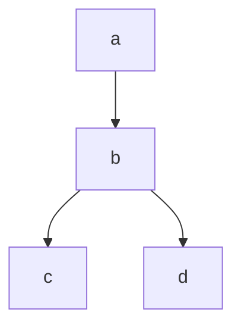

# Módulo de notas

## Modo edição

Atualmente no modo edição, apenas alguns itens, como o header, está sendo renderizado em tempo real. TODOS os outros elementos do markdown precisam ser renderizados em tempo real também (listas ordenadas, listas não-ordenadas, linha horizontal, links, imagens, código, bloco de código, tabelas, etc.)

A sintaxe avançada de markdown também deve estar disponível. Footnote não está disponível, por exemplo; heading ID (exemplo: ## Heading {#heading id}) não está disponível; superscript e subscript não estão disponíveis; highlight de palavras não está disponível.

Tabelas são itens especiais, elas precisam de um modo de selecionar várias células sequenciais segurando o clique do mouse e arrastando; o conteúdo das células deve poder ser removido com delete; se uma coluna ou uma linha for totalmente selecionada e pressionarmos delete, ela é deletada; se a tabela for totalmente selecionada e pressionarmos delete, ela deve ser excluída; deve haver botões para inserir células à direita ou abaixo.

## Referências

Utilizando a sintaxe `[[nota]]`, deve-se ser capaz de facilmente criar um link entre notas, exatamente como no obsidian. Ao digitar `[[]]`, deve-se mostrar um popup (como no obsidian), com uma lista de notas buscadas (por relevância), e a medida que o usuário digita, deve-se ter uma busca em estilo fuzzy finding, podendo-se escolher entre as notas com as setas do teclado.

**Embeds (`![[nota]]`):** Além da sintaxe `[[nota]]` para navegação, é necessário poder renderizar o conteúdo de uma nota (ou de um anexo como PDF e imagem) diretamente dentro do corpo de outra. Também temos aqui o fuzzy finding, podendo-se escolher entre as notas com as setas do teclado.

**Block References:** Capacidade de referenciar não apenas a nota inteira ou um Heading, mas apontar para um parágrafo ou item de lista específico (ex: `[[nota^id-do-bloco]]`).  Também temos aqui o fuzzy finding, podendo-se escolher entre os headings e parágrafos com as setas do teclado.

## Navegação

É necessário um botão de voltar, avançar na navegação.

**Backlinks (Links Inversos):** O painel direito (que já conterá o sumário) precisa de uma aba para listar quais outras notas apontam para a nota atual.

## Frontmatter

**Properties UI:** Uma interface visual amigável no topo da nota para visualizar e editar o YAML/Frontmatter, em vez de forçar o usuário a lidar com texto puro rodeado de `---`. A edição de texto puro será apenas no modo raw.

## LaTeX

O módulo deve ter suporte a sintaxe do LaTeX utilizando \$\$ *(a barra é apenas para escape)* para texto em uma linha ou \$\$\$\$ para texto em bloco, exemplo:

$a + b$ ^a2458b

$$
a + b
$$

## Escape

A barra de escape \ deve ser utilizada para cancelar a sintaxe do LaTeX ou a referência à nota, por exemplo.

## Mermaid

O módulo deve ter suporte à sintaxe do mermaid dentro de um bloco de código, exemplo:

## LSP e highlighting

O módulo deve ter suporte à highlighting a diversas linguagens de programação, sendo facilmente extensível pela comunidade (através de pull requests, ou através de plugins, se necessário), começando pelas principais linguagens.

## Painéis

Em vez de termos uma página que lista as notas, e outra página que exibe uma nota, devemos ter a exibição das notas em árvore no painel da esquerda (mostrando as pastas que também funcionam como notas assim como no Notion, e as notas dentro), a nota no meio, e à direita um painel com um botão localizado acima com ícone de 3 pontos que abre um menu; nesse menu, deve haver uma opção de sumário (que lista os headings, podendo-se clicar neles e ir para a seção clicada), que deve ser a opção padrão.

## Tags

As tags serão marcadas com o símbolo # e serão compartilhadas com todo o restante da aplicação.

## Comandos

Haverá uma command palette invocada através de ctrl + p, ou então através da barra /. Também temos aqui o fuzzy finding, podendo-se escolher entre as notas com as setas do teclado.

## Folding

Capacidade de esconder o conteúdo abaixo de um Heading específico ou colapsar níveis de uma lista aninhada.

## Produtividade e Layouts

**Split Panes e Abas**: Capacidade de dividir o editor verticalmente ou horizontalmente para consultar uma nota enquanto escreve em outra.

**Edição Modal (Vim Mode)**: Uma implementação de keybindings estilo Vim.

**Facilitadores**: Ao selecionar um texto e digitar ou deletar um caractere que precise ser "fechado", como `*` para itálico, `**` para negrito, `[` para referência à nota ou anexo, `"` ou `'` , deve-se fechar automaticamente. Deve ser possível selecionar a palavra, e ao digitar o caractere que precisa ser fechado, envolver a palavra no caractere.
