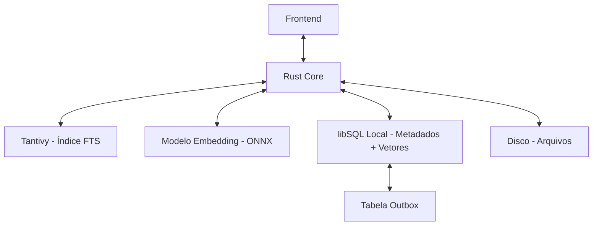

# Index e buscas

Atualmente o Ruas toma como fonte-da-verdade os arquivos markdown, tendo também arquivos .eml para os emails, criando um index utilizando o libSQL para indexação/cacheamento. Essa estratégia pode gerar gargalos de performance na busca em vaults com muitos arquivos, por conta do FTS do libsql não ser tão eficiente. Para sanar esses gargalos de performance, foi pensada uma arquitetura de CQRS, separando a função de escrita para o libSQL para persistência e a função de leitura para o Tantivy, que possui um FTS robusto. Além disso, o Ruas terá busca semântica para integração fluida com IA, por isso precisa da busca vetorial do libSQL e de um modelo de embedding carregado via ONNX.

## 1. Arquitetura

### Diagrama - Mermaid

## 2. O Core e a Interface

**Frontend (SolidJS):** É a interface visual do usuário. Apenas exibe dados e captura ações, sem realizar processamento pesado.
**Rust Core:** O "cérebro central" e maestro assíncrono. Recebe os pedidos do frontend, lê os arquivos físicos e decide para qual motor de busca ou banco de dados enviar as tarefas.

## 3. A Camada de Persistência

**Disco (Arquivos):** A verdadeira e única fonte dos dados brutos (os arquivos .md e .eml). Se tudo der errado, os dados continuam seguros aqui.

**libSQL Local:** O banco de dados relacional (ACID). Ele não guarda o texto completo, apenas organiza a "biblioteca": guarda os metadados (datas, status, caminhos dos arquivos), gerencia os relacionamentos (qual e-mail responde a qual) e armazena as coordenadas matemáticas da busca semântica (vetores).

**Tabela Outbox e Gatilho Reativo:** A "fila de tarefas" segura dentro do libSQL. Garante que, se o sistema for fechado abruptamente, nenhuma nota fique sem ser indexada na próxima vez que abrir.

* **Gatilho Reativo (MPSC Channel):** Para evitar *polling* constante no banco de dados (o que gastaria CPU), o Rust Core utiliza um canal assíncrono em memória (`tokio::sync::mpsc`).
* **Fluxo de Execução:** Ao salvar uma nota, o Core realiza a transação ACID no libSQL (gravando metadados e inserindo a tarefa no Outbox). Imediatamente após o *commit*, o Core dispara um sinal no canal (`tx.send`). Um *worker* assíncrono em background, que estava adormecido (`rx.recv().await`), acorda instantaneamente, processa os dados pendentes no Tantivy e ONNX, e deleta a linha do Outbox.
* **Crash Recovery:** Quando o Ruas é iniciado, o *worker* faz uma leitura inicial no banco (`SELECT * FROM outbox`) para processar qualquer tarefa que tenha ficado pendente devido a uma falha de energia, antes de entrar no modo de espera pelo canal.

## 4. Os Motores de Busca e Ingestão de Dados

**Modelo Embedding (ONNX / Candle):** O especialista em significado. Lê os parágrafos, transforma o contexto em vetores matemáticos (usando IA local) e envia esses vetores de volta para o Rust Core guardar no libSQL.

**Tantivy (Índice FTS):** O especialista em texto. Ele não busca apenas por palavras exatas, mas é o responsável por executar **Fuzzy Finding** e *Stemming*.

### 4.1 Schema do Tantivy

Para garantir a flexibilidade da busca sem perder a relevância (evitando o problema de *Double-Dipping* ou falsos positivos no cálculo do BM25), o Tantivy utilizará o seguinte Schema tipado:

* `uid`: Stored / String
* `path`: Stored / String
* `entity`: Stored / String (Não tokenizado, para filtros exatos como "nota", "contato")
* `title`: Text with stemming -> **Peso 3.0** na busca.
* `aliases`: Text with stemming -> **Peso 3.0** na busca.
* `tags`: String pura (Não tokenizado) -> **Peso 2.0** na busca.
* `fm`: JSON -> **Peso 1.5** na busca. (Abreviação de "frontmatter". Absorve todas as outras propriedades customizadas).
* `body`: Text with stemming -> **Peso 1.0** na busca.

### 4.2 Tratamento de Ingestão (Pop & Mutate)

No momento da indexação, o *Worker* em Rust atua como roteador. Para não haver sujeira nas pontuações (o mesmo dado pontuando duas vezes), o Rust lê o YAML original, **extrai** as propriedades Cidadãs de 1ª Classe (`tags` e `aliases`) para as suas respectivas colunas no Tantivy e **deleta** essas chaves do objeto JSON. Apenas o "resto" do objeto (telefone, status, etc.) é injetado no campo genérico `frontmatter`.

## 5. Busca Inteligente

O Ruas utilizará um sistema de busca inteligente combinando a força textual e semântica através da fórmula final: **BM25 com Field Boosting + Frecency + Contexto Hierárquico**.

### 5.1. Passo A: Rastreamento (No libSQL)

Duas colunas na tabela files:

* `times_opened` (Frequência - Inteiro).
* `last_access` (Recência - Timestamp Unix).

Sempre que o utilizador clica numa nota, contato, etc, o Rust dispara um comando assíncrono (um *fire-and-forget*) incrementando `times_opened` em 1 e definindo `last_access` como `now()`.

### 5.2. Passo B: Pontuação Base e Intenção (Tantivy)

O utilizador pesquisa "Docker". O Tantivy aplica o algoritmo **BM25**, respeitando o *Field Boosting* configurado no Schema (onde uma ocorrência no `title` vale 3x mais que no `body`). Ele devolve os 50 melhores resultados com os seus *scores* textuais brutos ajustados pela intenção.

### 5.3. Passo C: Ordenação e Alquimia de Pesos (O Rust Core atua)

O Rust pega os 50 IDs que o Tantivy devolveu e puxa do libSQL as estatísticas deles. Em milissegundos, calcula um **Score Final** para cada nota usando a seguinte equação matemática:

`Score Final = Score_BM25 * Frequência (times_opened) * Multiplicador_Tempo * Multiplicador_Contexto`

#### 5.3.1. O Multiplicador de Tempo (Frecency Suave)

Inspirado no Zoxide, o Rust calcula o tempo decorrido desde o `último acesso` e aplica a seguinte tabela de degraus temporais:

1. **< 1 hora:** Multiplicador de `8`.
2. **< 1 dia:** Multiplicador de `4`.
3. **< 1 semana:** Multiplicador de `2`.
4. **< 1 mês:** Multiplicador de `1` (Neutro).
5. **> 1 mês:** Multiplicador de `0.5` (Penalização leve).

Para evitar que uma nota lida 5.000 vezes crie um número gigantesco e intocável no banco (Aging/Envelhecimento), quando a soma total dos valores da coluna `times_opened` de todas as notas atinge 10.000, o sistema divide o valor da coluna `times_opened` de todos os registos pela metade, e define como 0 os que caírem abaixo de 1.

#### 5.3.2. O Multiplicador de Contexto Hierárquico

Para priorizar resultados que pertençam ao mesmo escopo de trabalho (ex: um projeto específico), aplica-se um bônus com base na distância da árvore de diretórios entre o arquivo atual e o arquivo encontrado. A base é `16x` e cai pela metade a cada nível de distância usando *Bit Shifting*:

* **Nível 0 (Mesmo diretório):** `16 >> 0` = Multiplicador `16`.
* **Nível 1 (Pai ou Filho direto):** `16 >> 1` = Multiplicador `8`.
* **Nível 2 (Avô ou Neto):** `16 >> 2` = Multiplicador `4`.
* **Nível 3:** `16 >> 3` = Multiplicador `2`.
* **Nível 4 ou mais (Sem relação):** `16 >> 4` = Multiplicador `1` (Neutro).
*(Se o arquivo for encontrado em múltiplas rotas relativas, vence o diretório de menor distância).*

Ambos os multiplicadores (Tempo e Contexto) podem ser resolvidos com um simples `match` no Rust e com operadores de *Bit Shifting* (ex: `score << 3` para multiplicar por 8, `score >> 1` para dividir por 2), garantindo performance extrema na *thread*.

## 6. Busca semântica

A busca semântica não será implementada ainda, ela será implementada na fase de implementação da integração com IA.

## 7. Resumo

Quando se salva uma nota, o Rust grava no Disco e no libSQL em milissegundos, enviando um sinal reativo que liberta a interface na hora. As atualizações no Tantivy e no ONNX ficam na fila (Outbox) e acontecem de forma invisível via worker assíncrono. Ao iniciar a aplicação, faz-se uma verificação assíncrona (para não travar a aplicação) para processar os arquivos pendentes no Outbox que possam ter sido interrompidos por encerramento abrupto do sistema.

Quando se faz uma pesquisa, o Rust Core não lê o disco; ele interroga o Tantivy (para palavras exatas ou fuzzy finding/stemming) ou os vetores do libSQL (para contexto semântico), cruza as informações, aplica a busca inteligente (BM25 com Boosting + Frecency Temporal + Contexto Hierárquico), e devolve o resultado final para o SolidJS instantaneamente.