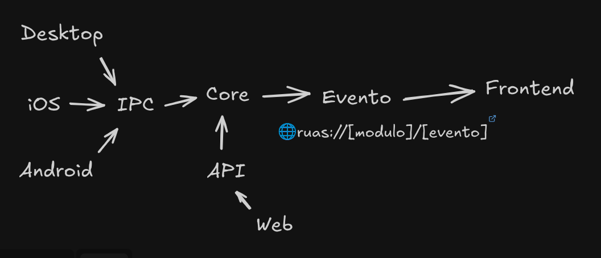

<p align="center">
  
</p>

<h1 align="center">Ruas, all-in-one productivity app</h1>

# Overview

Ruas is a cross-platform, privacy-first, self-hosted, all-in-one productivity app. 
The name Ruas is the combination of Rust + Astro, since the system is built using Rust (Tauri) and Astro.
Ruas also stands for Rapid Universal Annotation System.
In Portuguese, "ruas" means "streets", which references the connections (graphs) mapped out by the app.

The core concept is to gather the main features of a productivity app: Contacts, Agenda, Calendar, Projects, Notes, and Email, all oriented around Markdown—similar to Obsidian, Notion, Logseq, or AnyType. The app will feature integrations with other apps, plugins, and AI integration.

## Business Model

- Free self-hosted plan
- Pro plan with cloud synchronization across devices
- Pro+ plan with cloud synchronization across devices and AI

## Stack

- Tauri
- Astro
- SQLite (as an indexer)
- Actix

## Platforms

- Desktop
- Mobile
- Web (available for Pro plan and above)

## Structure

```
ruas/
├── core/           # system core
├── api/            # web api
└── frontend/
   ├── src           # web frontend
   └── src-tauri/   # desktop/mobile
```

## Custom Protocol

ruas://[module]/[event]

## Email

The email client uses JMAP or IMAP.

### Cache (SQLite) vs. Archiving (.eml / .md)

To keep the file system clean and the app performant:

1. Ruas uses JMAP to synchronize emails directly into a **local SQLite database**. SQLite serves as the high-speed search and read database.
2. When the user wants to "link" an email to a note or project:
    - Ruas generates an `.eml` file in a specific folder (e.g., `~/ruas/attachments/emails/`).
    - Inside the Markdown note, the link is structured as: `[Email Subject](ruas://email/file_id)`.

### HTML Sanitization and Security

- Use a Rust sanitization library (such as `ammonia`) before passing the email body to the frontend.
- **Isolation:** Render the email body inside an `<iframe>` with the `sandbox` attribute enabled. This prevents email trackers or malicious scripts from accessing local cookies or the file system through the Tauri bridge.

### Search (FTS5)

- SQLite allows creating virtual tables for instant lookups. Rust will index the *plain text* (converting the email's HTML into simplified Markdown/Text) within the database.
- **Multilingual:** Use `whatlang` to automatically detect the email's language and apply the correct stemmer (Portuguese, English, etc.) during indexation.

## Plugins 

- WASM for core logic
- JS for UI components

## Contacts

- Integration with cardDAV
- Search for contacts using the `@` handle to create active links
- Contacts will be stored as Markdown notes containing metadata in the frontmatter

## Agenda

- Integration with cardDAV
- Tasks will be stored as Markdown notes containing metadata in the frontmatter
- To add a task, press `Ctrl+P` to open the command palette, select "Add note", and type in natural language. The system will parse wildcards and keywords, similarly to Todoist or Vikunja. Example: "do something tomorrow +project \*tag1 \*tag2". The system generates a raw entry: `- [ ] do something tomorrow +project *tag1 *tag2`, but renders a clean checkbox, the text "do something tomorrow", and specific badges for "07/02", "tag1", and "tag2".
- The system must be multilingual, recognizing terms across multiple languages.

## Calendar

- Integration with calDAV
- Calendar entries will be stored as Markdown notes containing metadata in the frontmatter
- Command palette options to seamlessly move tasks to the calendar and vice versa
- Ability to create multiple calendars, with an option to merge them into a single view

## Notes

- Knowledge management workflow similar to Obsidian, Notion, AnyType, and Logseq.

## Projects

- Projects act as containers holding tasks, contacts, calendars, notes, and a dedicated dashboard.

## Sync

- State-based synchronization (Obsidian style)
- End-to-End Encryption (E2EE)

## Architecture

### File System Watcher

The Core must actively monitor the notes directory. Whenever a `.md` file is modified externally, the Core must transparently re-index the metadata (Frontmatter, tags, links) into the SQLite database.

### Versioning and Conflicts

A last-write-wins approach will be implemented, which gracefully handles collisions by spawning a duplicate `note.conflicted.md` file.

### Asset Management

Assets will be mapped into a specific `_resources` or `_assets` folder. SQLite will index these non-Markdown files so that searching for "Score" returns the physical PDF asset, not just the note mentioning it.

### Abstraction of the `ruas://` Protocol

Instead of pointing to raw paths like `ruas://note/path/to/file.md`, the app uses an abstract mapping: `ruas://entity/[UUID]`. SQLite maps where this UUID resides on the drive, allowing users to safely rename or move system folders without breaking internal app links.

### Plugin Host Context

How do the frontend and WASM interact? WASM plugins run natively inside the Core container to guarantee performance and sandboxed security. The Frontend simply requests the Core: "Execute function X of plugin Y and return the payload for rendering".

### Connection Types

The graph nodes generated by the app can have specific types (Contact, Task, Calendar Entry, Note, Email, Project), and the edges connecting these nodes are typed as well, for example:

- Mentions: A note references a `@contact`.
- DependsOn: A task depends on the completion of another task.
- Origin: An email thread that originated a specific note.
- BelongsTo: A note that is assigned to a `+project`.

### Architecture


